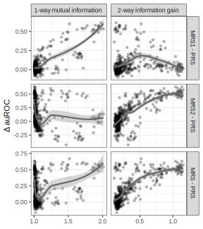

## Results

### MRS outperforms standard PRS

{#fig:auroc_mrs_prs}

To assess whether this improvement in performance correlates with , in the following section, we untangled the two components in MRS and apply information theory to 

### Assess improvement in performance

As the amount of main effects increases (Fig. {@fig: improvements} left), MRS1 increasingly performs better than PRS, which is likely because encodings are inferred (top left).
Meanwhile, MRS2's accuracy remain similar to that of PRS (middle left).
On the other hand, when the amount of interaction effects increases (right), MRS1 performs mostly on par to PRS while MRS2
Combinging the gain from both MR1 and MRS2, MRS's performance progressively increases compared to the standard PRS.

{#fig:improvements}